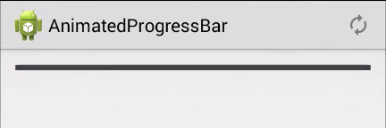

AnimatedProgressBar
===================
A ProgressBar that animates smoothly

| Branch | Build Status |
|--------|--------------|
| master | [](https://travis-ci.org/anthonycr/AnimatedProgressBar) |
| dev    | [](https://travis-ci.org/anthonycr/AnimatedProgressBar) |

| Latest Version |
|----------------|
| [](https://bintray.com/anthonycr/android/com.anthonycr.progress%3Aanimated-progress/_latestVersion) |



#### [Download Sample App](https://github.com/anthonycr/AnimatedProgressBar/releases/download/1.0.0/release.apk)

# Usage

#### From jcenter
* `compile 'com.anthonycr.progress:animated-progress:1.0'`

#### From submodule
* run `git submodule add git@github.com:anthonycr/AnimatedProgressBar.git /yourProject/subFolder`
* include the library in your `settings.gradle` file
    - `include ':animated-progress-bar'`
    - `project(':animated-progress-bar').projectDir = new File(rootProject.projectDir, '/yourProject/subFolder')`
* compile the project: `compile project(':animated-progress-bar')`

#### Other
* Copy `AnimatedProgressBar.java` and the contents of `attrs.xml` into your project and you're all set.

# API

#### XML Usage
```XML
<com.anthonycr.progress.AnimatedProgressBar
        xmlns:custom="http://schemas.android.com/apk/res-auto"
        android:id="@+id/progress_view"
        android:layout_width="match_parent"
        android:layout_height="5dp"
        android:background="#424242"
        custom:bidirectionalAnimate="true"
        custom:progressColor="#2196f3" />
```

- `progressColor`: set the progress color of the AnimatedProgressBar.
- `bidirectionalAnimate`: set to true to have it animate up and down, set it to false to only have it animate up.

#### Java Usage
```Java
int progressNum = 50;
progressBar = (AnimatedProgressBar) findViewById(R.id.progress_view);
progressBar.setProgress(50);
progressNum = progressBar.getProgress();
```

- `void setProgress(int number)`: a number between 0 and 100 that sets the progress of the view. If you set it out of these bounds, the view will set it to the closest bound, i.e. setting progress to 150 will correct it to 100.
- `int getProgress()`: returns an integer of the view's progress between 0 and 100.

# License

```
Copyright 2014 Anthony Restaino

   Licensed under the Apache License, Version 2.0 (the "License");
   you may not use this file except in compliance with the License.
   You may obtain a copy of the License at

       http://www.apache.org/licenses/LICENSE-2.0

   Unless required by applicable law or agreed to in writing, software
   distributed under the License is distributed on an "AS IS" BASIS,
   WITHOUT WARRANTIES OR CONDITIONS OF ANY KIND, either express or implied.
   See the License for the specific language governing permissions and
   limitations under the License.
```
